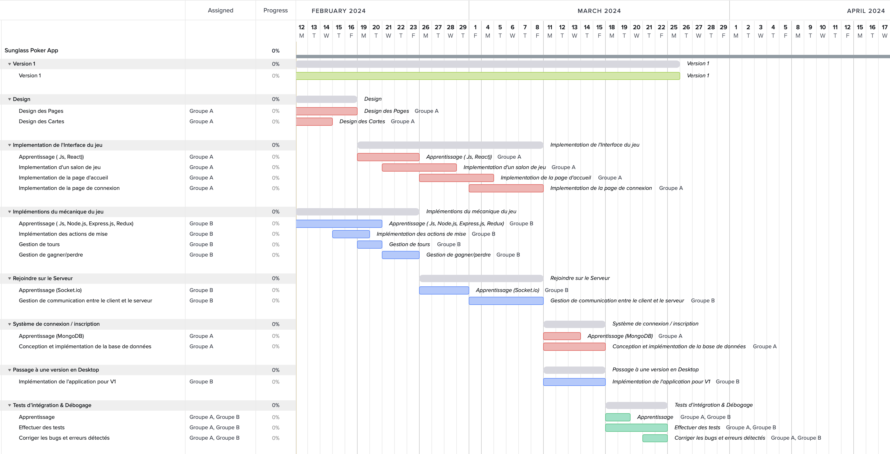
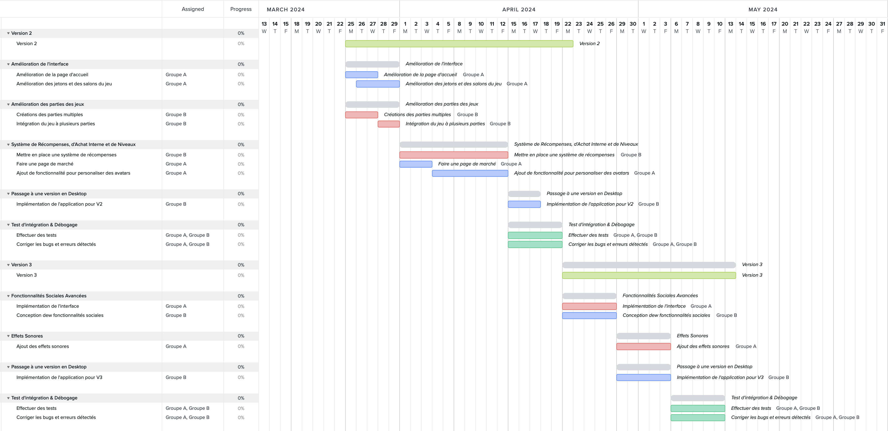

# Sunglass Poker

Online Poker Game

Made by: Sun Games Studio

For: L3S6 - Projet Integrateur 

# Cahier des Charges

### **Règles du jeu de poker :**

Le poker est un jeu de cartes où les joueurs parient sur la force de leurs mains. Les règles varient selon les variantes, mais la version la plus courante est le Texas Hold'em. Dans cette variante, chaque joueur reçoit deux cartes privées, et cinq cartes communes sont distribuées au centre de la table. Les joueurs doivent former la meilleure main possible en utilisant leurs cartes privées et les cartes communes. Les tours de mises se déroulent avant et après la distribution des cartes communes, avec des possibilités de relance, de suivi ou de se coucher.

Pour gagner au jeu de Poker - Texas Hold’em, les joueurs devront apprendre les dix façon basiques pour gagner, dans un ordre de la plus basse à la plus haute elles sont :

- **HIGH CARD (Carte haute)**
    
    → Si aucun joueur n'a aucune des autres combinaisons, la main la plus haute (ou la "carte haute") l'emporte. Cela signifie que le joueur avec la carte la plus haute dans sa main remporte le pot. 
    
    → En cas d'égalité, la deuxième carte la plus élevée est comparée, et ainsi de suite jusqu'à ce qu'une main gagnante soit déterminée.
    
- **ONE PAIR (Paire)**
    
    → Une paire est formée de deux cartes de même valeur, accompagnées de trois autres cartes qui ne forment pas de combinaisons spécifiques. Par exemple, deux cartes de 7 dans une main constituent une paire de 7. 
    
    → Si plusieurs joueurs ont une paire, la main avec la paire la plus élevée l'emporte. 
    
    → En cas d'égalité, la carte la plus élevée en dehors de la paire est comparée.
    
- **TWO PAIR (Double paire)**
    
    → Deux paires sont formées de deux paires distinctes de cartes de même valeur, accompagnées d'une cinquième carte sans correspondance. Par exemple, avoir deux cartes de 5 et deux cartes de 9 dans une main constitue une double paire. 
    
    → Si plusieurs joueurs ont deux paires, la main avec la paire la plus élevée l'emporte. 
    
    → En cas d'égalité, la deuxième paire est comparée, puis la carte la plus élevée en dehors des paires.
    
- **THREE OF A KIND (Brelan)**
    
    → Un brelan est formé de trois cartes de même valeur, accompagnées de deux autres cartes qui ne forment pas de combinaisons spécifiques. Par exemple, trois cartes de 10 dans une main constituent un brelan. 
    
    → Si plusieurs joueurs ont un brelan, la main avec le brelan le plus élevé l'emporte. 
    
    → En cas d'égalité, la carte la plus élevée en dehors du brelan est comparée.
    
- **STRAIGHT (Suite)**
    
    → Une suite est formée de cinq cartes consécutives de différentes couleurs. Par exemple, avoir les cartes 2, 3, 4, 5 et 6 dans une main constitue une suite. 
    
    → Si plusieurs joueurs ont une suite, la main avec la carte la plus élevée à l'extrémité de la suite l'emporte. 
    
    → En cas d'égalité, les joueurs partagent le pot.
    
- **FLUSH (Couleur)**
    
    → Une couleur est formée de cinq cartes de la même couleur, dans n'importe quel ordre. Par exemple, avoir cinq cartes de cœur dans une main constitue une couleur. 
    
    → Si plusieurs joueurs ont une couleur, la main avec la carte la plus élevée l'emporte. 
    
    → En cas d'égalité, les joueurs partagent le pot.
    
- **FULL HOUSE (Full)**
    
    → Un full est formé d'un brelan et d'une paire. Par exemple, avoir trois cartes de 8 et deux cartes de 4 dans une main constitue un full. 
    
    → Si plusieurs joueurs ont un full, la main avec le brelan le plus élevé l'emporte. 
    
    → En cas d'égalité, la paire est comparée.
    
- **FOUR OF A KIND (Carré)**
    
    → Un carré est formé de quatre cartes de même valeur, accompagnées d'une cinquième carte sans correspondance. Par exemple, avoir quatre cartes de roi dans une main constitue un carré. 
    
    → Si plusieurs joueurs ont un carré, la main avec le carré le plus élevé l'emporte. 
    
    → En cas d'égalité, la carte la plus élevée en dehors du carré est comparée.
    
- **STRAIGHT FLUSH (Quinte Flush)**
    
    → Une quinte flush est formée de cinq cartes consécutives de la même couleur. Par exemple, avoir les cartes 7, 8, 9, 10 et valet de pique dans une main constitue une quinte flush. 
    
    → Si plusieurs joueurs ont une quinte flush, la main avec la carte la plus élevée à l'extrémité de la suite l'emporte. 
    
    → En cas d'égalité, les joueurs partagent le pot.
    
- **ROYAL FLUSH (Quinte Flush Royale)**
    
    → La quinte flush royale est la plus haute main possible au poker. Elle est formée de cinq cartes consécutives de la même couleur, du 10 à l'as. Par exemple, avoir les cartes 10, valet, dame, roi et as de cœur dans une main constitue une quinte flush royale. 
    
    → Si plusieurs joueurs ont une quinte flush royale, ils partagent le pot, car cette main est invincible.
    

Pour jouer au Texas Hold’em, le type de jeu de poker le plus populaire, les joueurs doivent d'abord parier leurs **antes**. **Une ante** est une mise forcée où tous les joueurs placent une somme égale d’argent ou de jetons dans le pot avant que la distribution ne commence. Elle est généralement un petit pari de **1$**, **2$** ou **5$**, le montant étant décidé par la table.

Une fois que tous les joueurs ont mis leurs antes, le dealer distribuera **deux cartes à chaque joueur**, qui doivent rester secrètes. Les joueurs examinent ensuite leurs cartes et décident de parier ou non. À chaque tour de mise, un joueur peut choisir de :

- **SE COUCHER (FOLD)** : Ne pas jouer ce tour.
- **VÉRIFIER (CHECK)** : Égaliser la mise des autres joueurs.
- **Miser (RAISE) :** Ajouter plus d’argent au pot**.**

Les joueurs qui ne veulent pas **VÉRIFIER** leurs paris doivent se coucher, et si tous les joueurs se couchent sauf un, ce dernier remporte le pot.

Une fois que tous les joueurs ont misé, le **dealer** révèle **trois cartes**, connues sous le nom de **FLOP**. Dès que les joueurs voient ces cartes, ils commencent à réfléchir à la main qu’ils veulent former, sachant qu'il reste encore **deux cartes** à dévoiler. Après le **FLOP**, tous les joueurs ont une nouvelle chance de miser avant que le **dealer** ne révèle la prochaine carte, appelée le **TURN**.

Les joueurs peuvent encore parier s'ils le souhaitent, puis le **dealer** dévoile la dernière carte, appelée le **RIVER**. À ce stade, nous avons un total de **7 cartes** : **5** sur la table et **2** dans la main de chaque joueur. Les joueurs font alors leur dernière mise, après quoi tous les joueurs montrent leurs mains. L'objectif est que chaque joueur crée la meilleure main possible à partir de ces **7 cartes**, même s'il faut utiliser **une carte** de leur main et **4 cartes** de la table.

***Le joueur avec la meilleure main gagne.***

### **Objectifs de l'application :**

L'objectif de l'application est de fournir une plateforme de poker en ligne en temps réel, permettant à plusieurs joueurs de participer à une même partie et de jouer selon les règles du Texas Hold'em. Le but est de recréer une expérience de jeu authentique, avec des fonctionnalités telles que le chat entre joueurs, la gestion des mises, et l'évaluation des mains.

### **Transposition en version informatique :**

Pour transposer le poker en version informatique, nous allons diviser le processus en plusieurs algorithmes:

1. **Initialisation de la partie :** Le serveur crée une nouvelle partie, distribue les cartes aux joueurs, et distribue les cartes communes.
2. **Gestion des mises :** Le serveur gère les tours de mises en suivant les règles du jeu (par exemple, relance minimale, montant des mises autorisées, etc.).
3. **Évaluation des mains :** Le serveur évalue la force de chaque main des joueurs à la fin de chaque tour de mise.
4. **Détermination du gagnant :** Le serveur détermine le joueur ayant la meilleure main à la fin de la partie et distribue les gains en conséquence.
5. **Communication client-serveur :** Les clients envoient leurs actions (miser, suivre, se coucher) au serveur, qui met à jour l'état de la partie et envoie les informations nécessaires aux clients.

### **Attentes du commanditaire :**

Le commanditaire attend une application stable, sécurisée et conviviale, offrant une expérience de jeu fluide et réaliste. Il souhaite également que l'application soit capable de gérer un grand nombre de joueurs simultanément, tout en assurant l'intégrité du jeu et la sécurité des transactions.

### **Rôles des clients et du serveur :**

- **Serveur :** Le serveur est responsable de la logique de jeu, de la gestion des parties, de la distribution des cartes, de la gestion des mises et de la détermination des résultats. Il agit comme l'autorité centrale dans le jeu.
- **Clients :** Les clients sont les interfaces utilisateurs à travers lesquelles les joueurs interagissent avec le jeu. Ils envoient leurs actions au serveur (par exemple, miser, suivre, se coucher) et reçoivent les mises à jour de l'état de la partie. Les clients affichent également les informations nécessaires aux joueurs, telles que leurs cartes privées, les cartes communes, et les actions des autres joueurs.

---

## Les éléments clés

> Une interface utilisateur conviviale et intuitive est essentielle pour permettre aux joueurs d'interagir facilement avec le jeu. Cela inclut des éléments tels que des boutons pour les actions de jeu (miser, suivre, se coucher), un chat pour la communication entre joueurs, et des indicateurs visuels pour les cartes et les mises.
> 

> Une base de données sur le serveur permettra de stocker les identifiants des joueurs , leurs scores et les parties sauvegardées, ainsi que l'historique des jeux joués, des statistiques, les jetons, les amis, les NFT possédés, et l'inventaire des joueurs.
> 

> Un live server serait utilisé pour gérer en temps réel une salle de jeu, assurant ainsi une interaction fluide entre les joueurs et le jeu lui-même. Ce serveur en direct serait chargé de traiter les actions des joueurs en temps réel, telles que les mouvements, les interactions avec les objets du jeu et les mises à jour des données du joueur, tout en maintenant une synchronisation constante entre tous les participants de la salle de jeu.
> 

> Un système robuste de gestion de partie est nécessaire pour créer et gérer les parties de poker. Cela comprend la distribution des cartes, la gestion des tours de mise, le calcul des mains gagnantes et la distribution des gains.
> 

> Un moteur de jeu performant est nécessaire pour exécuter la logique du poker, y compris les règles du Texas Hold'em telles que les différentes phases de jeu (pré-flop, flop, turn, river), les combinaisons de mains, et les règles de mise.
> 

> La sécurité de l'application sera assurée directement par notre choix de langage de programmation qui ne permet pas l'accès direct au code source. Cette solution protège la propriété intellectuelle et réduit les risques de tricherie.
> 

---

## Les Technologies Employées

1.  **React :** React est une bibliothèque JavaScript largement utilisée pour la création d'interfaces utilisateur interactives. Son utilisation de composants réutilisables facilite le développement de l'interface utilisateur du jeu, ce qui permet une gestion efficace des différents éléments de l'interface, tels que les cartes, les boutons et les champs de saisie. De plus, sa virtual DOM assure des mises à jour efficaces de l'interface en fonction des actions des utilisateurs, ce qui est crucial dans un jeu en temps réel.
2. **Redux :** Redux est un conteneur d'état prévisible pour les applications JavaScript. Dans un jeu multi-utilisateur comme celui-ci, où de nombreuses actions peuvent se produire simultanément et où l'état du jeu doit être synchronisé entre tous les joueurs, Redux offre une gestion centralisée de l'état de l'application. Cela garantit une cohérence et une prévisibilité accrues dans la gestion de l'état de l'interface utilisateur et des données du jeu.
3. **Node.js et Express.js :** Node.js est un environnement d'exécution JavaScript côté serveur, et Express.js est un framework web minimaliste pour Node.js. Ils sont idéaux pour construire des applications web en temps réel comme un jeu en ligne. Avec Node.js et Express.js, vous pouvez facilement mettre en place un serveur HTTP pour gérer les connexions des clients, les requêtes et les réponses, ainsi que pour gérer la logique métier du jeu côté serveur.
4. **MongoDB :** MongoDB est une base de données NoSQL flexible et évolutive. Dans un jeu en ligne, où les données des utilisateurs, telles que les informations d'identification, les profils, et les statistiques de jeu, doivent être stockées et récupérées rapidement, MongoDB offre une solution efficace. Son modèle de données flexible permet de stocker facilement des données complexes telles que les profils de joueurs et les configurations de jeu.
5. **Socket.io :** Socket.io est une bibliothèque JavaScript qui permet une communication bidirectionnelle en temps réel entre les clients web et le serveur. Dans un jeu multi-joueur, la synchronisation en temps réel des actions des joueurs est cruciale pour assurer une expérience de jeu fluide. Socket.io facilite la mise en place de cette communication en temps réel, permettant aux joueurs d'interagir les uns avec les autres et avec le serveur en temps réel.
6. **Electron.js :** Electron.js est un framework permettant de développer des applications de bureau multiplateformes en utilisant des technologies web telles que HTML, CSS et JavaScript. En développant une version de bureau de jeu avec Electron.js, nous allons offrir une expérience utilisateur cohérente sur différentes plateformes, tout en utilisant les compétences et les technologies web déjà maîtrisées.
7. **JSDoc :** [JSDoc](https://jsdoc.app) est un langage de balisage utilisé pour documenter les codes sources JavaScript. En utilisant des commentaires qui contiennent des informations pour JSDoc, les développeurs peuvent créer la documentation de leurs interfaces de programmation (ou désigné par API en anglais) du code qu'ils créent. 
8. **Git :** Utilisation de ****Git dans ce projet offre un contrôle de version robuste, facilite la collaboration entre les membres de l'équipe de développement, permet une gestion efficace des branches de développement et facilite le déploiement continu du code.

---

### Rôles de chef de projet

Le rôle principal d'un chef de projet consiste à organiser efficacement l'utilisation des diverses ressources disponibles en les répartissant en différentes activités ou tâches, tout en assurant que leur séquence garantisse le respect du périmètre défini du projet. En plus de coordonner les différents sous-groupes impliqués dans le projet, le chef de projet est chargé de la rédaction des rapports hebdomadaires. Son travail est principalement axé sur la gestion d'équipe plutôt que sur le développement. Il est également responsable de surveiller de près l'avancement du projet et d'intervenir pour trouver des solutions en cas de problèmes rencontrés. Par ailleurs, le chef de projet doit élaborer et maintenir un plan de projet détaillé, communiquer régulièrement avec les parties prenantes, gérer les risques potentiels, superviser le processus de suivi et de contrôle, faciliter les réunions d'équipe, assurer le respect des normes de qualité, gérer les conflits, suivre les dépenses et évaluer les performances de l'équipe tout en assurant une communication claire et transparente avec toutes les parties prenantes concernées.

---

## **Composition de l'équipe**

- **Chef de Projet :** Melissa Ertekin
- **Tech Lead :** Abdoul Aziz Diallo
- **Première Équipe (A) :**
    
    Membres :
    
    - Maël Heinrich
    - Mostafa Haghvirdiloo
    - Noé Demangeon
- **Deuxième Équipe (B) :**
    
    Membres :
    
    - Akli Hadef
    - Franck William Djeufack Akono
    - Victor Gierlowski
    - Ziad Ez-Zaidi

---

## Version 1 | Durée : 6 Semaine | Date Limitée : 25 Mars 2024

<aside>
🔥 Cette version initiale se concentre sur l'élaboration des fondations de l'application. Le groupe A travaillera sur le développement de l'interface de jeu, y compris la création des pages de connexion et d'accueil. L'accent est mis sur la convivialité de l'interface, avec des fonctionnalités telles qu'un minuteur de jeu, l'affichage des joueurs et des cartes, ainsi que des boutons d'action. Pendant ce temps, le groupe B se chargera de mettre en œuvre les mécaniques de jeu, en gérant l'initiation et la progression du jeu, ainsi que la possibilité pour les joueurs de rejoindre des parties sur le serveur. L'objectif est de garantir une base solide pour le développement ultérieur.

</aside>

### **Interface de Jeu | Durée :  4 Semaine | Groupe A**

- Concevoir et mettre en œuvre l'interface de salon du jeu, comprenant :
    - Un minuteur pour la durée du jeu et la progression des tours.
    - Affichage des noms des joueurs, des jetons, des positions et des mises/actions.
    - Visualisation des cartes sur la table et dans la main du joueur.
    - Boutons d'action, champs de saisie pour les mises, et un bouton de départ.
- Concevoir et mettre en œuvre l’interface de la page de connexion
- Concevoir et mettre en œuvre l'interface de page d’accueil, comprenant :
    - Un salon à joindre pour jouer
    - Accès à la page tutoriel

### **Mécaniques de Jeu | Durée : 2 Semaine | Groupe B**

- Gérer l'initiation et la progression du jeu, notamment :
    - Attente du démarrage de la partie (message HTTP du serveur).
    - Réception des cartes et du rôle du serveur (via une socket).
    - Gestion du minuteur de tour et des phases de jeu (ex. : pré-flop, flop, turn).
    - Implémentation des actions de mise (ex. : call, raise, fold) et gestion des mises "all-in".
    - Intégration de la logique de détermination des conditions de victoire/défaite.
- Effectuer des tests unitaires.

### **Rejoindre sur le Serveur | Durée : 2 Semaine | Groupe B**

- Créer une interface simple avec un bouton pour envoyer un message au serveur afin de vérifier si le joueur peut rejoindre une partie.
    - En cas de réponse positive, passer à l'attente du démarrage de la partie.
    - En cas de réponse négative, retourner au menu principal.
- Effectuer des tests unitaires.

### **Système de Connexion / Inscription | Durée : 1 Semaine | Groupe A**

- Configurer le stockage des informations utilisateur dans une base de données, incluant :
    - Nom, prénom, âge, email, mot de passe haché, nom d'utilisateur.
- Intégrer l'API Google pour la création de compte ou la connexion.
- Mettre en place un système permettant aux utilisateurs de choisir un nom d'utilisateur unique, en respectant des règles spécifiées.
- Implémentation la fonctionnalité d'envoi automatique d'emails pour la réinitialisation des mots de passe.
- Effectuer des tests unitaires.

### **Passage de version web en version desktop  | Durée : 1 Semaine | Groupe B**

- Création de l’application dans une version Desktop.
- Effectuer des tests approfondis sur toutes les fonctionnalités du jeu pour garantir leur bon fonctionnement sur un autre environnement.

### **Tests d’intégration, Documentation partielle et Débogage  | Durée : 1 Semaine  | Groupe A et B**

- Effectuer des tests approfondis sur toutes les fonctionnalités du jeu pour garantir leur bon fonctionnement.
- Corriger les éventuels bugs et erreurs détectés lors des tests.
- Optimiser les performances du jeu pour assurer une expérience utilisateur fluide.
- Documentation du code

---

## Version 2 | Durée : 4 Semaine  | Date Limitée : 22 Avril 2024

<aside>
🔥 Dans cette version, l'accent est mis sur l'amélioration de l'expérience utilisateur et l'ajout de fonctionnalités supplémentaires. Le groupe A se concentrera sur l'amélioration de l'interface de jeu et l'ajout de nouvelles fonctionnalités à la page d'accueil, telles que l'accès au marché. Le groupe B travaillera sur la possibilité pour les joueurs de rejoindre des parties personnalisées et sur la mise en place d'un système de récompenses, d'achats internes et de niveaux. L'objectif est d'enrichir l'expérience de jeu et d'encourager l'engagement des joueurs.

</aside>

### **Interface de Jeu | Durée : 1 Semaine | Groupe A**

- Amélioration de l’interface de jeux
- Concevoir et mettre en œuvre l'interface de page d’accueil, comprenant :
    - Accès à la page du marché
    - Des salons à joindre pour jouer
- Effectuer des tests unitaires.

### **Rejoindre sur le Serveur | Durée : 1 Semaine | Groupe B**

- Rejoindre une partie personnalisée ou l’une des parties en cours ****
    - Concurrence des parties sérieuses et partie personnalisée
    - Création de partie custom ou sérieuse en cas de non-existence de partie sérieuse avec les paramètres de l’utilisateur
- Effectuer des tests unitaires.

### Système de Récompenses, d’Achat Interne et de Niveaux | Durée : 2 **Semaines | Groupe A et B**

- Mettre en place un système de récompenses et de niveaux pour les joueurs, basé sur leur performance, leur participation et leur engagement.
- Offrir des récompenses telles que des jetons bonus, des avatars spéciaux, des skins de cartes ou des accessoires personnalisés en fonction du niveau atteint.
- Mettre en place un marché pour des achats internes.
- Effectuer des tests unitaires.

### **Passage de version web en version desktop  | Durée : 1/2 Semaine | Groupe B**

- Création de l’application dans une version Desktop.
- Effectuer des tests approfondis sur toutes les fonctionnalités du jeu pour garantir leur bon fonctionnement sur un autre environnement.

### **Tests d’intégration, Documentation partielle et Débogage  | Durée : 1 Semaine | Groupe A et B**

- Effectuer des tests approfondis sur toutes les fonctionnalités du jeu pour garantir leur bon fonctionnement.
- Optimiser les performances du jeu pour assurer une expérience utilisateur fluide.
- Corriger les éventuels bugs et erreurs détectées lors des tests.
- Documentation du code

---

## Version 3 (Finale) | Durée : 3 Semaine  | Date Limitée :  13 Mai 2024

<aside>
🔥 La version finale se concentre sur l'ajout de fonctionnalités avancées et l'amélioration des aspects sociaux du jeu. Le groupe A travaillera sur l'implémentation d'une interface pour des fonctionnalités sociales avancées, telles que la création de clubs de joueurs et le partage de succès sur les réseaux sociaux, ainsi que sur l'ajout d'effets sonores au jeu. Pendant ce temps, le groupe B ajoutera des fonctionnalités sociales avancées et finalisera le passage de l'application en version desktop. L'objectif est de fournir une expérience de jeu enrichie et immersive, tout en renforçant la dimension sociale de l'application.

</aside>

### **Interface pour Les Fonctionnalités Sociales Avancées : 1 Semaine | Groupe A**

- Implémentation de l’interface pour des fonctionnalités sociales avancées telles que la possibilité de former des clubs de joueurs, de participer à des discussions de groupe et de partager des succès sur les réseaux sociaux.
- Effectuer des tests unitaires.

### Fonctionnalités Sociales Avancées : **1 Semaine | Groupe B**

- Ajouter des fonctionnalités sociales avancées telles que la possibilité de former des clubs de joueurs, de participer à des discussions de groupe et de partager des succès sur les réseaux sociaux.
- Effectuer des tests unitaires.

### Effets Sonores | Durée : **1 Semaine | Groupe A**

- Ajout des effets sonores pour les action du jeu

### **Passage de version web en version desktop  | Durée : 1 Semaine | Groupe B**

- Création de l’application dans une version Desktop.
- Effectuer des tests approfondis sur toutes les fonctionnalités du jeu pour garantir leur bon fonctionnement sur un autre environnement.

### **Tests d’intégration, Documentation partielle et Débogage  | Durée : 1 Semaine | Groupe A et B**

- Effectuer des tests approfondis sur toutes les fonctionnalités du jeu pour garantir leur bon fonctionnement.
- Corriger les éventuels bugs et erreurs détectées lors des tests.
- Optimiser les performances du jeu pour assurer une expérience utilisateur fluide.
- Documentation du code

---

### Documentation du projet en totalité et contrôle finale du projet  | Durée : 1 semaine (Dernière semaine avant le rendu)

---

### Préparation à la soutenance | Durée : 1 semaine (Dernière semaine avant la soutenance)

---

## Fonctionnalités Optionnelle

<aside>
🔥 Les fonctionnalités optionnelles offrent une possibilité d'extension du jeu en proposant des mécaniques de jeu plus variées, telles que la gestion de différents types de jeux de poker, ainsi que la possibilité de choisir le type de jeu et de rejoindre des parties sur le serveur. Ces fonctionnalités permettent d'offrir une expérience de jeu plus diversifiée et personnalisée aux utilisateurs, tout en maintenant la qualité et la robustesse de l'application.

</aside>

### **Mécaniques de Jeu :**

- Gérer l'initiation et la progression du jeu pour des différentes types de jeu poker, notamment :
    - Attente du démarrage de la partie (message HTTP du serveur).
    - Réception des cartes et du rôle du serveur (via une socket).
    - Gestion du minuteur de tour et des phases de jeu (ex. : pré-flop, flop, turn).
    - Implémentation des actions de mise (ex. : call, raise, fold) et gestion des mises "all-in".
    - Intégration de la logique de détermination des conditions de victoire/défaite.
- Effectuer des tests unitaires.

### **Choix du type de jeu et Rejoindre sur le Serveur :**

- Créer une interface simple avec un bouton pour envoyer un message au serveur afin de vérifier si le joueur peut rejoindre une partie.
    - En cas de réponse positive, passer à l'attente du démarrage de la partie.
    - En cas de réponse négative, retourner au menu principal.
- Effectuer des tests unitaires.

---

## Gantt

### Gantt Générale

### Gantt Détaillée de Version 1

### Gantt Détaillée de Version 2 & Version 3

